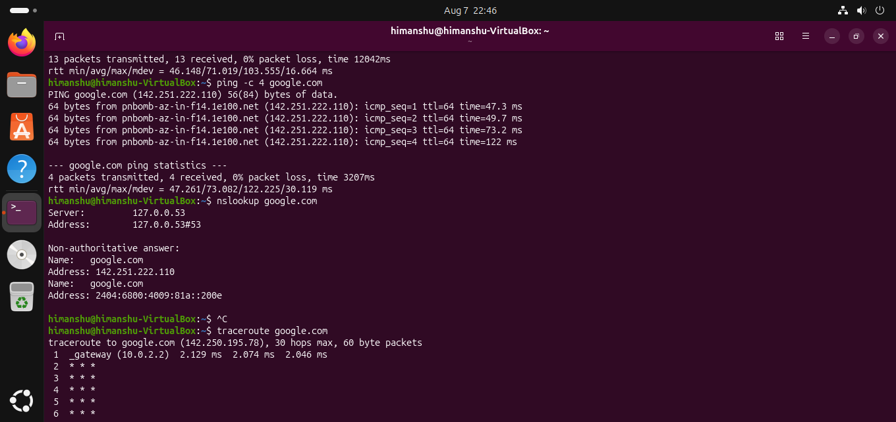

# Practical 1 - Ping, DNS Lookup & Traceroute

- `ping -c 4 google.com` checks whether my system can reach the destination by sending ICMP packets.
- `nslookup google.com` converts the domain name into its IP address using DNS.
- `traceroute google.com` shows the path (hops) that packets take to reach the destination. Some hops may show `* * *` because certain routers do not respond to traceroute requests.
